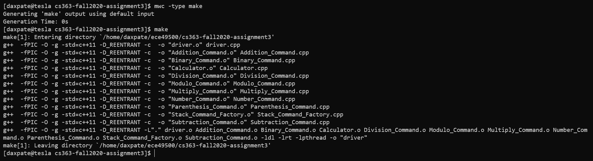
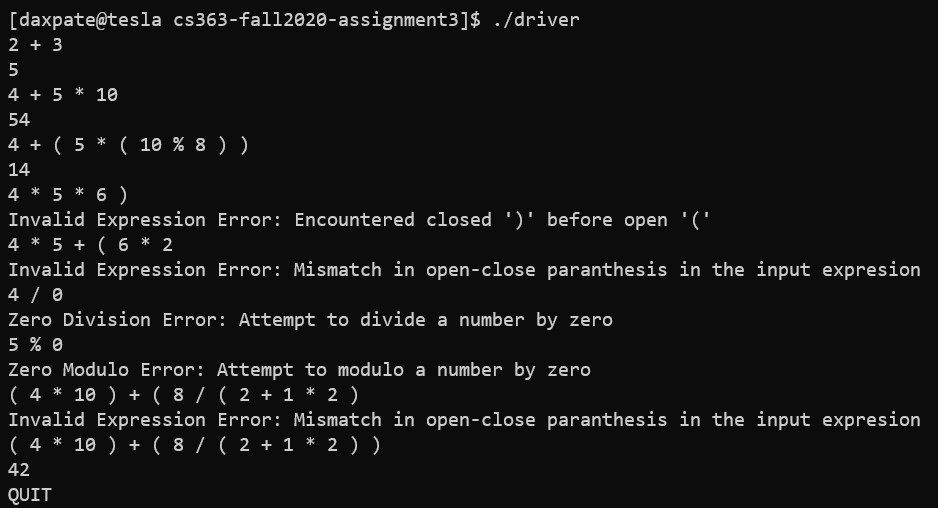
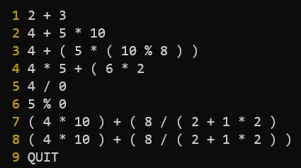
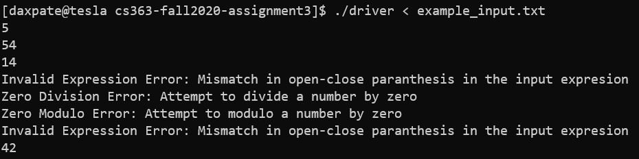

# cs363-fall2020-assignment3

## Notes for the Grader
- Dr. Hill Commented on the following two files:
    - `Division_Command.cpp`
        - `Comment` : Handle divide by zero
    - `Calculator.cpp`
        - `Comment` : Handle Parenthesis for expression

## Proof of working version on tesla
- Generate makefiles if not done already. This can be done by:
    - Make sure you are in the `cs363-fall2020-assignment3` directory
    - Use the following command to generate makle files:
        - `mwc -type make`
- Compile the project using make file
    - Make sure you are in the `cs363-fall2020-assignment3` directory
    - Use the following command to compile the project:
        - `make`
- After sucessfully finishing above steps, following should be the output

- Example to test the program

# Use File Redirection For Testing
- Instead of user having to type expressions one-by-one, they can leverage 
  the functionalioty of redirecting output for testing.
- To use redirection, first prepare an input file, where each line contains expression
  to be evaluated. Following is an example of input file:
- 
- Run program in the following way:
    
    - Each line in above image is result of evaluating expression
        from example_input.txt
